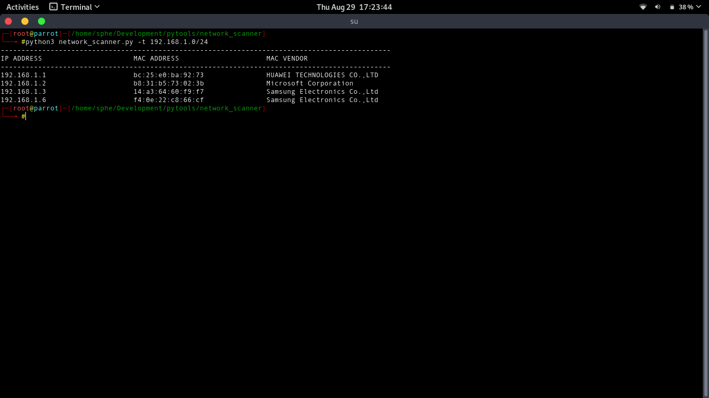

# sp3_network_scanner :grin:
This a simple network scanner that runs on linux, here i use the mac address lookup api http://macvendors.co/api/
it uses a mac address prefix list, thought it was better using the api instead of having a file locally with a huge list of mac address prefixes. :wink:

## Before you run:
1. `chmod +x requirements.sh`
2. `./requirements.sh`

## Sample output:

`python3 network_scanner -t 192.168.1.0/24`

